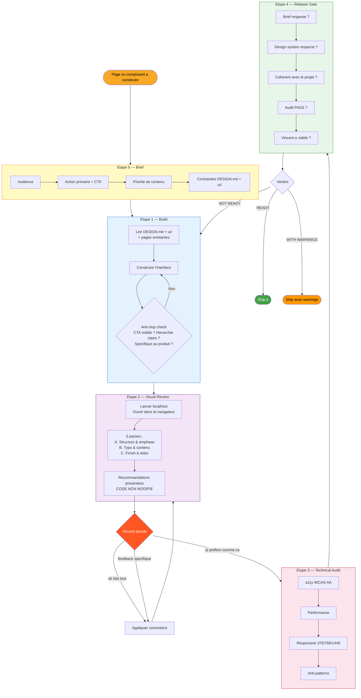
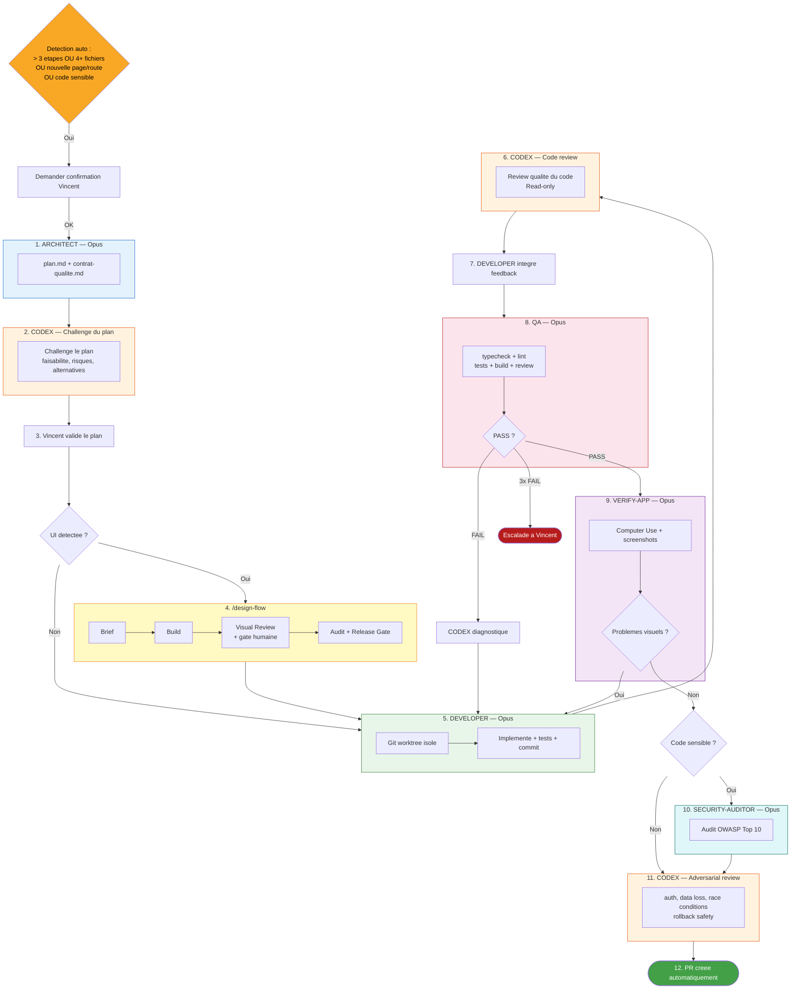
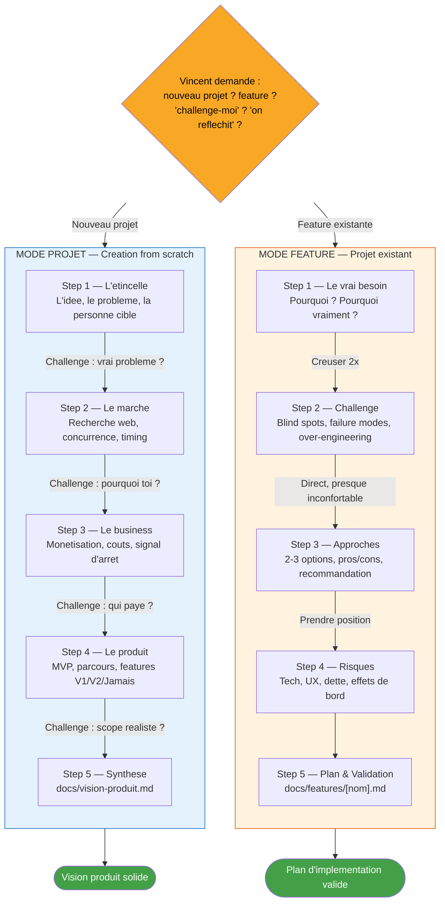
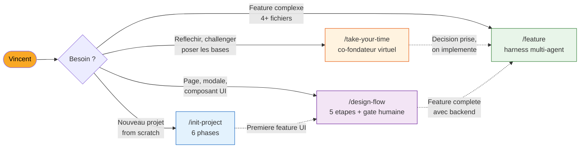

# Skills — Diagrammes visuels

## /init-project

Initialisation complete d'un nouveau projet en 6 phases sequentielles.

```mermaid
flowchart TD
    START([Vincent : "nouveau projet"]) --> P1

    subgraph P1["Phase 1 — Decouverte"]
        Q1[Le probleme] --> Q2[Les utilisateurs]
        Q2 --> Q3[Le scope MVP]
        Q3 --> Q4[Les contraintes]
        Q4 --> Q5[Le business]
        Q5 --> RESUME[Resume structure]
    end

    P1 -->|Vincent valide| P2

    subgraph P2["Phase 2 — Stack"]
        ANALYSE[Analyse du projet] --> RESEARCH[Recherche web]
        RESEARCH --> RECO[Stack recommandee + alternatives ecartees]
    end

    P2 -->|Vincent valide| P3

    subgraph P3["Phase 3 — Vision & Roadmap"]
        VISION[docs/vision-produit.md] --> ROAD[Roadmap par phases]
        ROAD --> PH0[Phase 0 : Direction Artistique]
        ROAD --> PH1[Phase 1 : Fondations]
        ROAD --> PHN[Phase 2+ : Features]
    end

    P3 -->|Vincent valide| P4

    subgraph P4["Phase 4 — Installation preset"]
        direction LR
        CLAUDE_MD[CLAUDE.md] ~~~ RULES[rules/ x7]
        RULES ~~~ AGENTS[agents/ x8]
        AGENTS ~~~ SKILLS_P[skills/]
        SKILLS_P ~~~ CONTEXTS[contexts/ x3]
        CONTEXTS ~~~ DESIGN[DESIGN.md]
    end

    P4 --> P5

    subgraph P5["Phase 5 — Init technique"]
        DEPS[Installer stack] --> CONFIG[Config TS + linter + formatter]
        CONFIG --> STRUCT[Structure src/]
        STRUCT --> CHECK["Build + lint OK ?"]
    end

    P5 --> P6

    subgraph P6["Phase 6 — GitHub"]
        COMMIT["chore: initial setup"] --> REPO["gh repo create --private"]
        REPO --> PROTECT[Branch protection main]
    end

    P6 --> DONE([Projet pret])

    style START fill:#f9a825,color:#000
    style DONE fill:#43a047,color:#fff
    style P1 fill:#e3f2fd,stroke:#1565c0
    style P2 fill:#e8f5e9,stroke:#2e7d32
    style P3 fill:#fff3e0,stroke:#e65100
    style P4 fill:#f3e5f5,stroke:#6a1b9a
    style P5 fill:#e0f7fa,stroke:#00695c
    style P6 fill:#fce4ec,stroke:#b71c1c
```

---

## /design-flow

Pipeline UI en 5 etapes. Gate humaine au Visual Review — Claude propose, Vincent decide.



---

## /feature

Harness multi-agent pour les features complexes. Double review Codex + Opus a chaque etage.



---

## /take-your-time

Co-fondateur virtuel avec 2 modes.



---

## Vue d'ensemble — Quand utiliser quel skill


